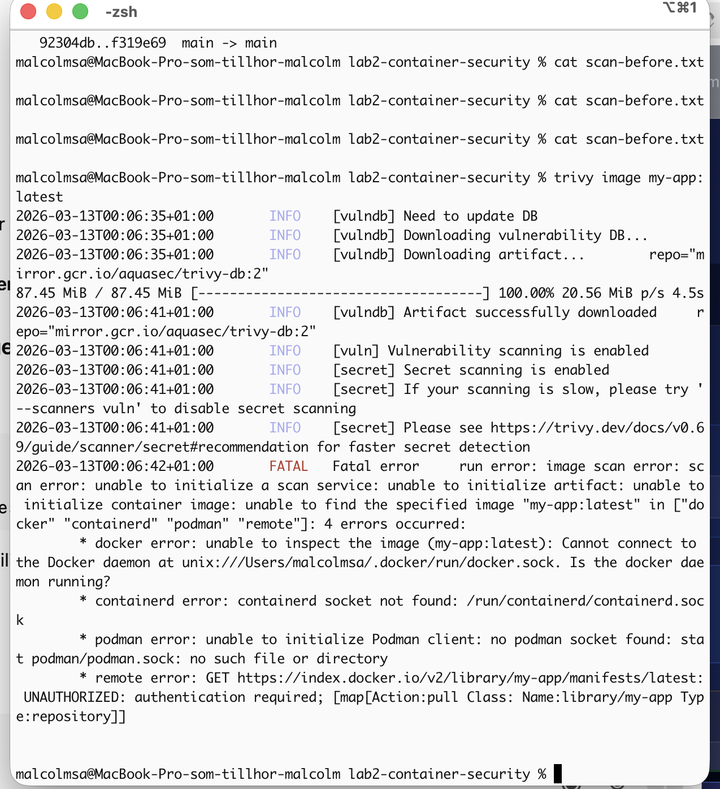
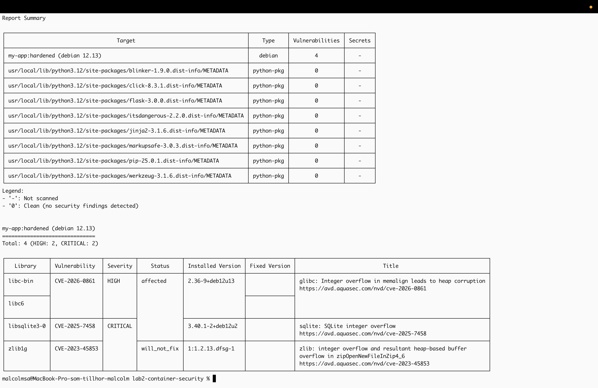
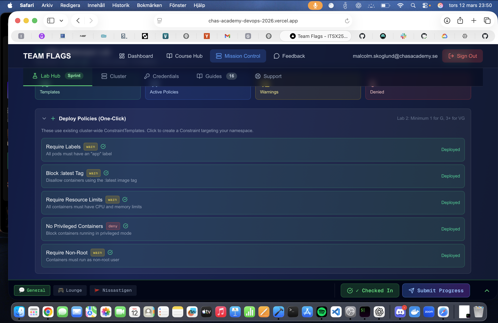
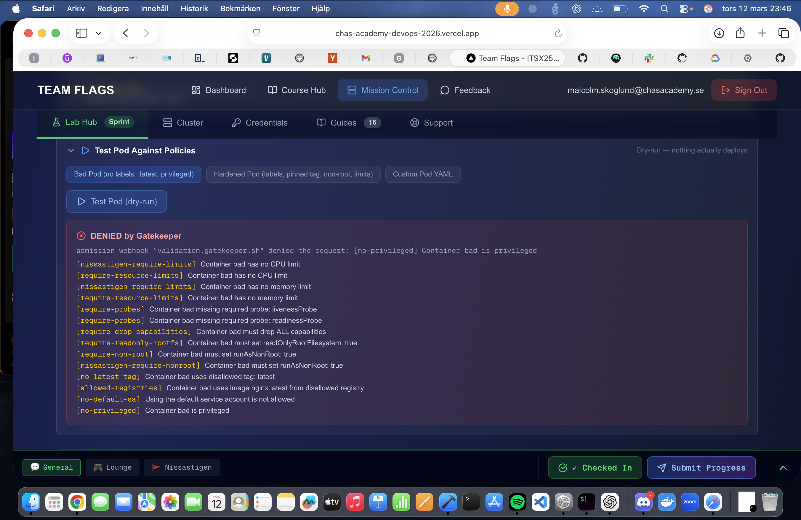
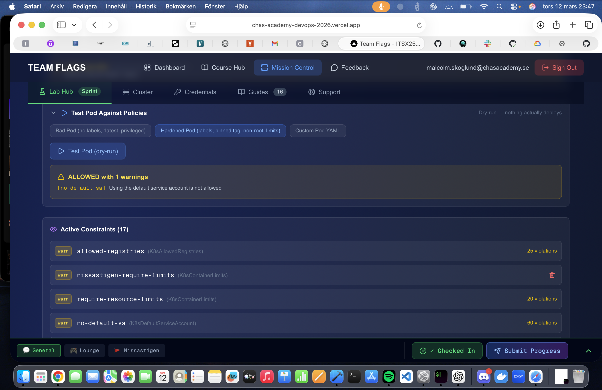

# Labb 2, Container Security

## Översikt

I denna labb arbetade jag med containersäkerhet genom att skanna en sårbar container, analysera säkerhetsproblem och därefter förbättra säkerheten steg för steg.

Syftet med labben var att förstå hur säkerhet kan byggas in i containers och hur vanliga sårbarheter kan identifieras och åtgärdas.

---

## 1. Sårbarhetsskanning med Trivy

Jag skapade först en medvetet sårbar Flask-applikation och byggde den med en osäker Dockerfile.

### Sårbar Dockerfile

- Gammal base image
- Gammal Flask-version
- Ingen hardening
- Körs med standardinställningar

Jag använde därefter Trivy för att skanna containern och identifiera säkerhetsproblem.

### Identifierade problem

- Föråldrade paket
- Kända CVE-sårbarheter
- Onödiga paket installerade
- Ingen princip om minsta privilegium
- Root-användare användes i containern

---

## 2. Förbättrad Containersäkerhet

Efter analysen hårdnade jag containern genom flera säkerhetsåtgärder.

### Säkerhetsförbättringar

- Uppdaterad base image
- Uppdaterade Python- och Flask-versioner
- Minimal image
- Non-root user
- Färre installerade paket
- Förbättrad Dockerfile-struktur

Jag genomförde därefter en ny Trivy-skanning för att verifiera förbättringarna.

---

## 3. Container Signing med Cosign

Jag använde Cosign för att signera container-imagen och verifiera dess integritet.

### Syfte

- Säkerställa att imagen inte manipulerats
- Verifiera äkthet
- Förbättra supply chain-säkerhet

---

## 4. Policy Enforcement med Gatekeeper

Jag implementerade säkerhetspolicies med Gatekeeper för att förhindra osäkra containers.

### Exempel på policies

- Blockera containers som körs som root
- Kräva säkerhetsinställningar
- Förhindra osäkra deployment-konfigurationer

---

## Utmaningar

Labben var betydligt svårare än tidigare moment och innehöll mycket felsökning.

### Problem jag stötte på

- Docker-images fungerade inte alltid korrekt
- Trivy-skanningar gav många felmeddelanden
- Policy-regler blockerade deployment
- Versionsproblem mellan verktyg
- Konfigurationsfel i containrar

### Hur jag löste problemen

- Läste igenom kursens slides och dokumentation
- Felsökte steg för steg
- Använde officiell dokumentation
- Testade olika konfigurationer
- Verifierade varje säkerhetsåtgärd separat

Labben var utmanande men väldigt lärorik och gav praktisk förståelse för containersäkerhet och säker utveckling.

---

## Verktyg som användes

- Docker
- Docker Compose
- Trivy
- Cosign
- Kubernetes
- Gatekeeper
- Flask
- Python

---

## Screenshots

### Trivy före hardening

### Trivy efter hardening

### Cosign verifiering

### Gatekeeper blockerar osäker konfiguration

### Gatekeeper godkänner säker konfiguration

---

## Slutsats

Denna labb gav praktisk erfarenhet av containersäkerhet, sårbarhetsskanning och hardening.

Jag fick en tydligare förståelse för:
- Hur osäkra containers kan identifieras
- Hur images kan hårdnas
- Hur policy enforcement fungerar
- Hur supply chain-säkerhet implementeras i praktiken
